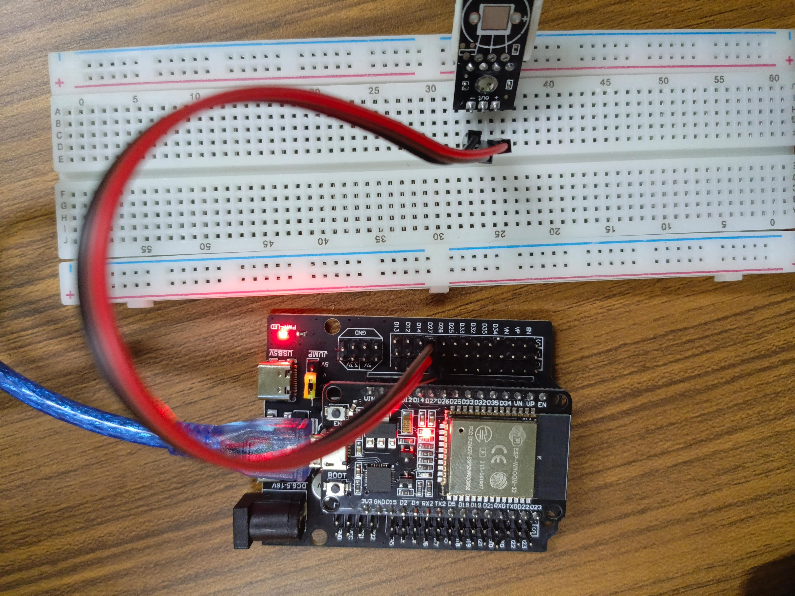
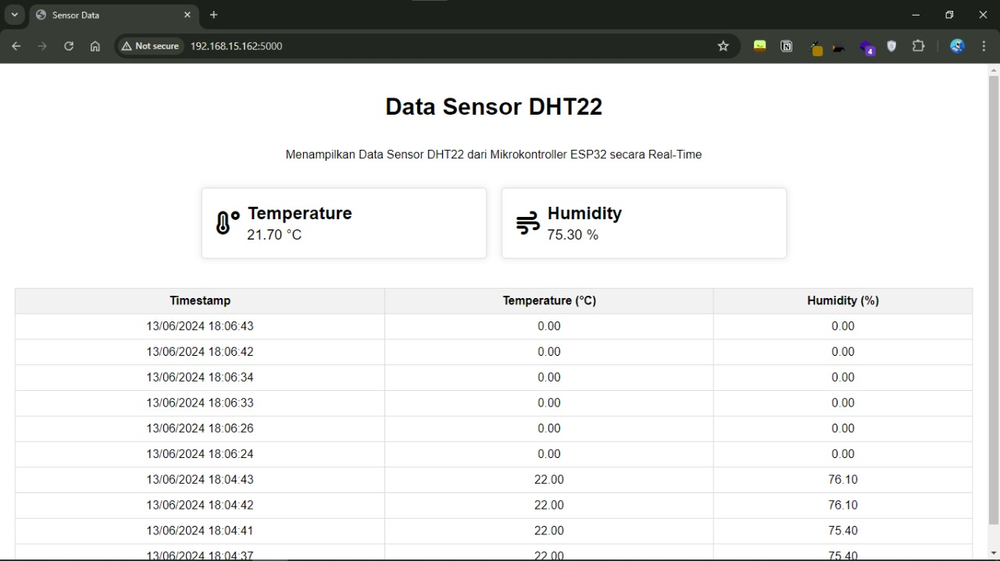

# ESP32-FLASK-DHT22-SENSOR
Tugas Technical Assignments SIC 2024<br>
Saya menggunakan Sensor DHT22 (Temprature & Humidity) sebagai Input-nya, ESP32 melakukan POST Data Sensor, dan Flask menampilkan data yang diterima dari ESP32.

# Identitas Diri
Nama         : Ahmad Hamra<br>
Tim          : EnviroMind<br>
Asal Sekolah : MAN 2 Jakarta<br>

# Alat dan bahan
- ESP32
- Sensor DHT22 (Tempratur dan Kelembaban)
- Kabel Jumper

# Pin ESP32 TO SENSOR
| ESP32 | Sensor DHT22       |
|----------------|------------------|
| 5V / 3V| + |
| GND | - |
| 27 | OUT |
# Foto Rangkaian Fisik


# Program Arduino IDE
```c++
#include <WiFi.h>
#include <HTTPClient.h>
#include "DHT.h"

#define DHTPIN 27     // Pin di mana sensor DHT22 terhubung
#define DHTTYPE DHT22   // DHT 22 

DHT dht(DHTPIN, DHTTYPE);

const char* ssid = "AHR"; // Alamat SSID menyesuaikan
const char* password = "12345678"; // Alamat Password menyesuaikan
const char* serverName = "http://192.168.15.162:5000/sensor/data"; // Alamat IP menyesuaikan

void setup() {
  Serial.begin(115200);
  dht.begin();

  WiFi.begin(ssid, password);
  Serial.print("Connecting");
  while (WiFi.status() != WL_CONNECTED) {
    delay(500);
    Serial.print(".");
  }

  Serial.println("");
  Serial.print("Connected to ");
  Serial.println(ssid);
  Serial.print("IP address: ");
  Serial.println(WiFi.localIP());
  delay(5000);
}

void loop() {
  float h = dht.readHumidity();
  float t = dht.readTemperature();

  if (isnan(h) || isnan(t)) {
    Serial.println("Failed to read from DHT sensor!");
    return;
  }

  if (WiFi.status() == WL_CONNECTED) {
    HTTPClient http;
    http.begin(serverName);
    http.addHeader("Content-Type", "application/x-www-form-urlencoded");

    String postData = "temperature=" + String(t, 2) + "&humidity=" + String(h, 2);

    int httpResponseCode = http.POST(postData);

    if (httpResponseCode > 0) {
      Serial.println(httpResponseCode);
      Serial.println(postData);
    } else {
      Serial.print("Error on sending POST: ");
      Serial.println(httpResponseCode);
    }

    http.end();
  } else {
    Serial.println("Error in WiFi connection");
  }

  delay(1000); // Kirim data setiap 1 detik
}
```
Klik tautan berikut untuk melihat kode <br>
[kirim_data.ino](kirim_data/kirim_data.ino)

# Program Python Flask
Program Flask
```python

from flask import Flask, request, jsonify, render_template
from flask_cors import CORS
from datetime import datetime

app = Flask(__name__)
CORS(app)

data_list = []

@app.route('/')
def index():
    return render_template('index.html')

@app.route('/sensor/data', methods=['POST'])
def receive_data():
    temperature = request.form.get('temperature')
    humidity = request.form.get('humidity')

    if temperature is not None and humidity is not None:
        try:
            temperature = float(temperature)
            humidity = float(humidity)
            timestamp = datetime.now().strftime('%d/%m/%Y %H:%M:%S')
            data = {"temperature": temperature, "humidity": humidity, "timestamp": timestamp}
            data_list.append(data)
            return jsonify({"message": "Data received"}), 200
        except ValueError:
            return jsonify({"message": "Invalid data format"}), 400
    else:
        return jsonify({"message": "Missing parameters"}), 400

@app.route('/data', methods=['GET'])
def get_data():
    return jsonify(data_list), 200

if __name__ == '__main__':
    app.run(host='0.0.0.0', port=5000)
```
Atau bisa lihat pada link berikut : <br>
[main.py](main.py)

# Tampilan Dashboard Data Sensor DHT22


# Program Dashboard Data Sensor DHT22
```html
<!DOCTYPE html>
<html lang="en">
<head>
    <meta charset="UTF-8">
    <meta name="viewport" content="width=device-width, initial-scale=1.0">
    <title>Sensor Data</title>
    <link rel="stylesheet" href="https://cdnjs.cloudflare.com/ajax/libs/font-awesome/6.0.0-beta3/css/all.min.css">
    <style>
        body {
            font-family: Arial, sans-serif;
            margin: 0;
            padding: 20px;
            display: flex;
            flex-direction: column;
            align-items: center;
        }
        .container {
            display: grid;
            grid-template-columns: 1fr 1fr;
            gap: 20px;
            width: 100%;
            max-width: 800px;
            margin: 20px 0;
        }
        .widget {
            display: grid;
            grid-template-columns: auto 1fr;
            align-items: center;
            padding: 20px;
            border: 1px solid #ddd;
            border-radius: 5px;
            box-shadow: 0 0 10px rgba(0, 0, 0, 0.1);
        }
        .icon {
            font-size: 2em;
            margin-right: 10px;
        }
        .value h2, .value p {
            margin: 0;
        }
        .value p {
            font-size: 1.2em;
        }
        table {
            width: 100%;
            border-collapse: collapse;
            margin-top: 20px;
        }
        th, td {
            border: 1px solid #ddd;
            padding: 8px;
            text-align: center;
            cursor: pointer;
        }
        th {
            background-color: #f2f2f2;
        }
        th.sorted-asc::after {
            content: ' ▲';
        }
        th.sorted-desc::after {
            content: ' ▼';
        }
        .pagination {
            display: flex;
            justify-content: space-between;
            margin-top: 20px;
        }
        .pagination button {
            padding: 10px 20px;
            border: none;
            background-color: #007bff;
            color: white;
            cursor: pointer;
            border-radius: 5px;
        }
        .pagination button:disabled {
            background-color: #ddd;
            cursor: not-allowed;
        }
    </style>
</head>
<body>
    <h1>Data Sensor DHT22</h1>
    <p>Menampilkan Data Sensor DHT22 dari Mikrokontroller ESP32 secara Real-Time</p>
    <div class="container">
        <div class="widget" id="temperature-widget">
            <i class="fas fa-temperature-high icon"></i>
            <div class="value">
                <h2>Temperature</h2>
                <p id="temperature-value">-- °C</p>
            </div>
        </div>
        <div class="widget" id="humidity-widget">
            <i class="fas fa-wind icon"></i>
            <div class="value">
                <h2>Humidity</h2>
                <p id="humidity-value">-- %</p>
            </div>
        </div>
    </div>
    <table id="data-table">
        <thead>
            <tr>
                <th onclick="sortTable('timestamp')">Timestamp</th>
                <th onclick="sortTable('temperature')">Temperature (°C)</th>
                <th onclick="sortTable('humidity')">Humidity (%)</th>
            </tr>
        </thead>
        <tbody>
            <!-- Data will be inserted here dynamically -->
        </tbody>
    </table>
    <div class="pagination">
        <button id="prev-button" onclick="prevPage()">Previous</button>
        <button id="next-button" onclick="nextPage()">Next</button>
    </div>
    <script>
        let data = [];
        let currentPage = 1;
        const rowsPerPage = 10;
        let sortOrder = {
            column: 'timestamp',
            direction: 'desc'
        };

        async function fetchData() {
            try {
                const response = await fetch('/data');
                if (!response.ok) {
                    throw new Error('Network response was not ok ' + response.statusText);
                }
                data = await response.json();
                data.sort((a, b) => new Date(b.timestamp) - new Date(a.timestamp));
                updateWidgets();
                updateTable();
            } catch (error) {
                console.error('Fetch error: ', error);
            }
        }

        function updateWidgets() {
            if (data.length > 0) {
                const latestData = data[0];
                document.getElementById('temperature-value').textContent = `${latestData.temperature.toFixed(2)} °C`;
                document.getElementById('humidity-value').textContent = `${latestData.humidity.toFixed(2)} %`;
            }
        }

        function sortTable(column) {
            if (sortOrder.column === column) {
                sortOrder.direction = sortOrder.direction === 'asc' ? 'desc' : 'asc';
            } else {
                sortOrder.column = column;
                sortOrder.direction = 'asc';
            }
            data.sort((a, b) => {
                if (sortOrder.direction === 'asc') {
                    return a[column] > b[column] ? 1 : -1;
                } else {
                    return a[column] < b[column] ? 1 : -1;
                }
            });
            updateTable();
        }

        function updateTable() {
            const tbody = document.getElementById('data-table').querySelector('tbody');
            tbody.innerHTML = '';
            const start = (currentPage - 1) * rowsPerPage;
            const end = start + rowsPerPage;
            const pageData = data.slice(start, end);
            pageData.forEach(entry => {
                const row = document.createElement('tr');
                row.innerHTML = `
                    <td>${entry.timestamp}</td>
                    <td>${entry.temperature.toFixed(2)}</td>
                    <td>${entry.humidity.toFixed(2)}</td>
                `;
                tbody.appendChild(row);
            });
            updatePaginationButtons();
            updateTableHeaders();
        }

        function updatePaginationButtons() {
            document.getElementById('prev-button').disabled = currentPage === 1;
            document.getElementById('next-button').disabled = currentPage * rowsPerPage >= data.length;
        }

        function updateTableHeaders() {
            const headers = document.querySelectorAll('th');
            headers.forEach(header => {
                header.classList.remove('sorted-asc', 'sorted-desc');
                if (header.textContent.includes(capitalize(sortOrder.column))) {
                    header.classList.add(sortOrder.direction === 'asc' ? 'sorted-asc' : 'sorted-desc');
                }
            });
        }

        function prevPage() {
            if (currentPage > 1) {
                currentPage--;
                updateTable();
            }
        }

        function nextPage() {
            if (currentPage * rowsPerPage < data.length) {
                currentPage++;
                updateTable();
            }
        }

        function capitalize(string) {
            return string.charAt(0).toUpperCase() + string.slice(1);
        }

        setInterval(fetchData, 1000); // Fetch data every second
        fetchData(); // Initial fetch
    </script>
</body>
</html>
```
Klik tautan berikut untuk melihat kode <br>
[index.html](templates/index.html)

